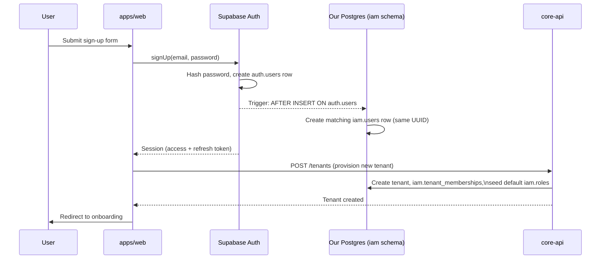
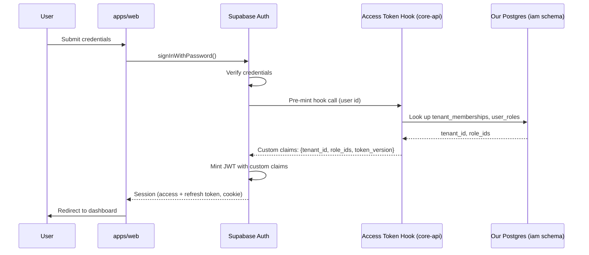
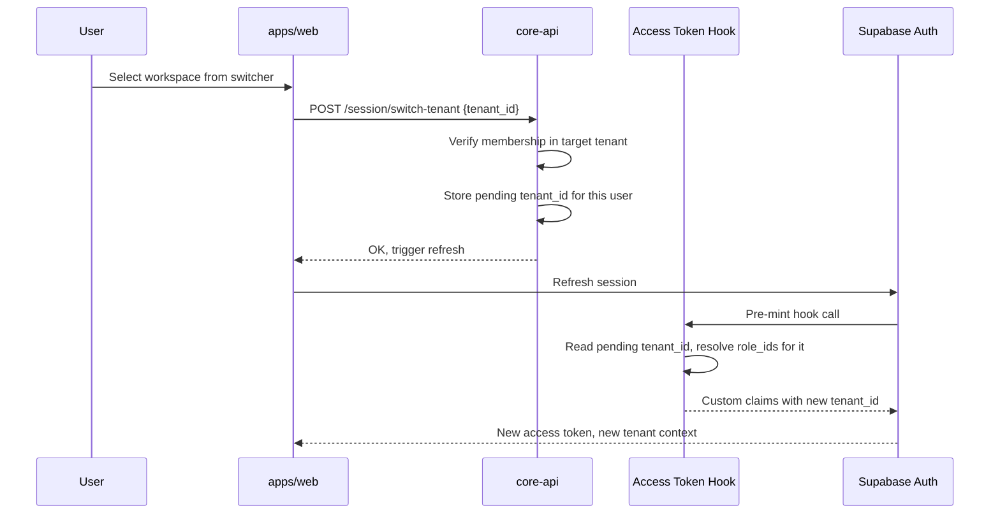
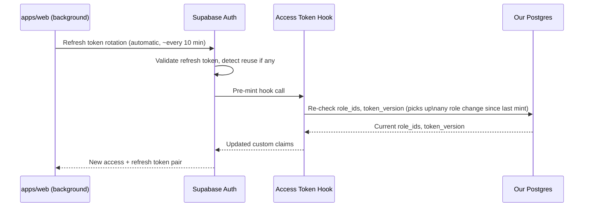
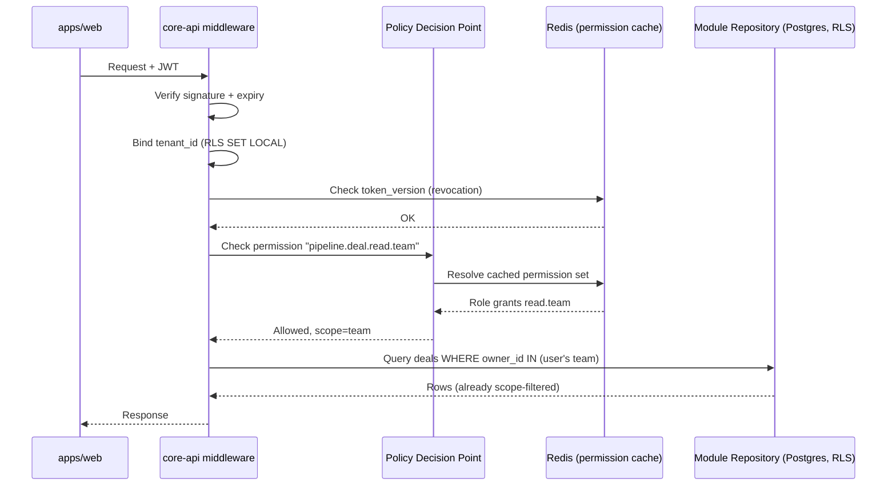
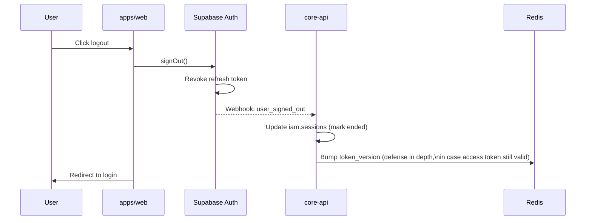
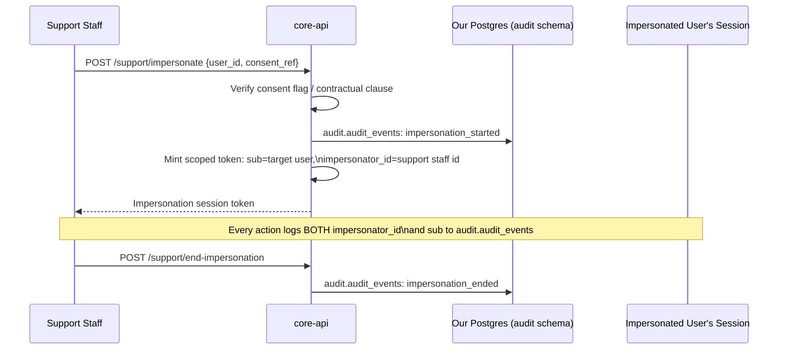

# Elewate GrowthOS — Authentication & Authorization Architecture

**Status:** Design only. No code, no schema changes, no folders created. Awaiting
approval before any implementation begins.

**Reads alongside:** Architecture Blueprint §8 (Authentication), §9 (Authorization/RBAC),
§10 (Multi-Tenant Design), §12 (Security Model); Database Schema Part C (`iam`).

---

## 0. A pivot to flag before anything else

**Supabase Auth does not appear anywhere in the Architecture Blueprint, TDD, Database
Schema, or UX Specification.** I checked directly rather than assuming — zero
mentions across all four source documents. Architecture §8 specifies a **custom-built**
Identity Service: Argon2id password hashing, a hand-rolled OAuth 2.1/OIDC flow, and a
central token-issuing service living inside `platform/iam`.

Adopting Supabase Auth is a legitimate, common pattern — but it changes *who does what*
compared to §8's original design, and it raises one genuinely open question (§7 below)
that affects the Docker Compose + Prisma + self-hosted Postgres work already done in
earlier milestones. I'm flagging the reconciliation explicitly throughout rather than
quietly rewriting §8's intent. Nothing here is final until you've seen §7's fork and
picked a direction.

---

## 1. Executive Summary

**Supabase Auth becomes the credential/identity front door. Our own `iam` schema
remains the source of truth for tenancy, roles, and permissions.**

- Supabase Auth (GoTrue) owns: password storage/verification, magic link, OAuth social
  login, enterprise SSO/SAML, MFA enrollment, JWT signing, and refresh-token rotation
  with reuse detection.
- Our `iam.*` tables (exactly as the Database Schema doc defines them) own: tenant
  membership, roles, permissions, role-permission assignments, RLS tenant isolation,
  and audit logging.
- The bridge between the two is a **Custom Access Token Hook** — Supabase calls out to
  us right before minting every access token, we tell it which `tenant_id` and
  `role_ids` to embed as custom claims, sourced from our own `iam` tables. This is what
  lets a Supabase-issued JWT still satisfy Architecture §8.1's requirement that every
  access token embed `tenant_id`, `user_id`, `role_ids`, and a `token_version`.
- `iam.users.id` and Supabase's `auth.users.id` are **the same UUID** — no separate
  mapping table. A database trigger creates the companion `iam.users` row the moment
  Supabase creates an `auth.users` row.

---

## 2. Folder Structure

Everything below is **proposed**, not created. `platform/iam/` and
`packages/permissions-schema/` already exist as empty scaffolds from earlier
milestones (confirmed by checking the repo directly) — this fills them in on paper
only.

```
services/core-api/src/platform/iam/
├── domain/
│   ├── entities/          # User, TenantMembership, Role, Permission, Session —
│   │                       # framework-agnostic, no Supabase/Prisma imports
│   ├── value-objects/      # PermissionKey ("module.resource.action.scope"), TokenClaims
│   └── events/             # RoleAssigned, MembershipRevoked, SessionRevoked
├── application/
│   ├── commands/           # AssignRole, RevokeSession, SwitchActiveTenant,
│   │                       # StartImpersonation, EndImpersonation
│   ├── queries/             # GetUserPermissions, GetActiveSessions, GetAuditTrail
│   └── policy/               # The Policy Decision Point (PDP) — central
│                              # RBAC+ABAC evaluation, called by every module's
│                              # use cases before executing (Architecture §9.3:
│                              # "deny-by-default")
├── infrastructure/
│   ├── supabase/
│   │   ├── access-token-hook/   # The HTTP endpoint Supabase calls pre-mint
│   │   │                         # (see §7 — this is the Option B shape)
│   │   ├── webhook-handlers/     # user_signed_in, token_refreshed, user_signed_out
│   │   └── supabase-admin-client/ # Service-role client for admin operations
│   │                                # (force-logout, ban user, etc.)
│   ├── repositories/        # Prisma-backed: RoleRepository, PermissionRepository,
│   │                         # TenantMembershipRepository, SessionRepository
│   └── cache/                # RedisPermissionCache (Architecture §9.3),
│                               # RedisRevocationList (token_version lookups)
├── interface/
│   ├── rest/                 # Supabase webhook receiver, session introspection
│   └── graphql/               # `me` query, `assignRole`/`switchTenant` mutations
└── middleware/                # Fastify hooks — see §8

packages/permissions-schema/src/
├── permission-catalog.ts     # The `module.resource.action.scope` string catalog,
│                              # generated/kept in sync with iam.permissions
├── policy-types.ts            # Shared RBAC/ABAC rule shapes (role, scope,
│                               # attribute-rule types) — imported by both
│                               # core-api's PDP and frontend conditional rendering
└── index.ts

apps/{web,admin,portal}/
├── middleware.ts              # Next.js edge middleware — session cookie refresh
│                               # + redirect-to-login, via @supabase/ssr
└── lib/supabase/
    ├── client.ts               # Browser Supabase client factory
    └── server.ts                # Server Component / Route Handler client factory
```

**Not proposed:** any change to `src/modules/*`. Every module's own
`infrastructure/repositories/` continues to enforce RLS + call the PDP exactly as
already planned — this design doesn't change that contract.

---

## 3. JWT Strategy

- **Issuer:** Supabase Auth, not a custom service — a direct change from Architecture
  §8.3's "central Identity Service issues... tokens."
- **Signing:** Supabase project JWT secret (HS256 by default) or asymmetric signing
  keys (ES256) if enabled on the Supabase project — asymmetric is preferable so
  core-api can verify signatures against a public JWKS endpoint without holding a
  shared secret; flagging this as a configuration choice to confirm when this is
  actually set up.
- **Standard claims:** `sub` (user id), `email`, `aud`, `exp`, `iat`, `role`
  (Supabase's own Postgres role concept — not to be confused with our `iam.roles`).
- **Custom claims** (injected via the Access Token Hook, §7): `tenant_id` (the
  session's active tenant), `role_ids` (array, from `iam.user_roles` for that
  membership), `token_version` (incremented on password change / security event, for
  fast revocation).
- **Lifetime:** 10–15 minutes, matching Architecture §8.1 exactly — configured in
  Supabase Auth project settings, not in our own code.
- **Verification (core-api):** signature check against Supabase's JWKS (cached,
  short TTL) → expiry check → `token_version` check against Redis (catches
  revocation faster than the token's own natural expiry; see §9 Session Lifecycle).
- **Multi-tenant nuance:** a user can belong to multiple tenants
  (`iam.tenant_memberships` is many-to-many per the Database Schema doc), but a JWT
  only carries **one** active `tenant_id`. Switching tenants doesn't re-authenticate —
  it triggers a `SwitchActiveTenant` command that updates a pointer (see §7) and forces
  one token refresh, which re-invokes the hook with the new tenant context.

---

## 4. Refresh Token Strategy

- **Rotation:** handled entirely by Supabase Auth — rotates on every use, reuse
  triggers full session-family revocation. This is a built-in Supabase Auth behavior,
  not something we implement, and it satisfies Architecture §8.3's rotation-detection
  requirement without custom code.
- **Storage:**
  - Web (`apps/web`, `apps/admin`, `apps/portal`): httpOnly, secure, SameSite cookies,
    managed by the `@supabase/ssr` package's cookie helpers — refresh tokens are never
    exposed to client-side JS, matching Architecture §8.1.
  - Mobile (future, `apps/mobile`): Supabase's mobile SDK secure-keystore pattern —
    not designed in detail here since no mobile auth work is scheduled yet.
- **Our supplementary tracking:** `iam.sessions` (Database Schema §C.7) stops being
  the primary refresh-token store (Supabase's own `auth.sessions`/`auth.refresh_tokens`
  now own that) and becomes a **secondary record** of session metadata relevant to our
  own product: which tenant was active, IP/user-agent for the user's own "active
  sessions" security page, and our `token_version` for the revocation check in §3.
  Populated via Supabase Auth webhooks (`token_refreshed`, `user_signed_in`,
  `user_signed_out`) received at `infrastructure/supabase/webhook-handlers/`.

---

## 5. RBAC

Structure is unchanged from Architecture §9.2 — Supabase Auth doesn't touch this layer
at all:

```
Tenant
 └── Roles (iam.roles — tenant-customizable, seeded from system templates)
      └── Permission Sets (iam.role_permissions → iam.permissions,
                            "module.resource.action.scope")
Users → iam.tenant_memberships → iam.user_roles → iam.roles
```

- `iam.permissions` is the **global, platform-defined catalog** (not tenant-scoped) —
  exactly per Database Schema §C.4.
- `iam.role_permissions` is where a tenant's role gets specific permissions assigned,
  with an optional `scope_override` JSONB for ABAC narrowing (§6).
- **Permission resolution:** the PDP (`application/policy/`) first tries the fast path
  — `role_ids` straight from the JWT's custom claim, no DB hit. If claims are stale
  (e.g., a role was just changed and the token hasn't refreshed yet), it falls back to
  a Redis-cached lookup, invalidated on `RoleAssigned`/role-change events published to
  the platform event bus — this is Architecture §9.3's "permission resolution is
  cached (Redis)... sub-millisecond" requirement, unchanged by the Supabase pivot.
- **Deny-by-default:** the PDP returns "denied" on any permission key it doesn't find
  an explicit grant for. No module's use case executes without a PDP check first.

---

## 6. ABAC

Layered on top of RBAC, evaluated by the same PDP immediately after the RBAC check
passes:

- **Ownership scoping** (`own` / `team` / `all`) comes from `scope_override` on
  `iam.role_permissions` — e.g., a `Sales Rep` role might hold
  `pipeline.deal.read.team` rather than `.all`.
- **Enforcement point:** not a post-query filter. The PDP's ABAC result (e.g.,
  "restrict to `owner_id IN (this user's team)`") is passed down to the repository
  layer and becomes part of the SQL `WHERE` clause — filtering happens at the data
  layer, never client-side, so a denied record is never even transmitted.
- **Field-level permissions:** e.g., hiding a deal's margin field from a rep who can
  see the deal itself. Enforced at the GraphQL resolver / REST response-shaping layer:
  a field-to-permission map is consulted when building the response DTO, stripping
  fields the caller's resolved permission set doesn't include.
- **Territory/department scoping:** same `scope_override` mechanism, generalized —
  the JSONB shape supports arbitrary attribute rules, not just ownership, per
  Architecture §9.1's "attribute rules narrow scope dynamically."

---

## 7. Supabase Auth Integration — and one fork that needs a decision

### What Supabase owns
Credential storage/verification (replaces Argon2id — Supabase hashes passwords
itself), magic link, OAuth social providers, MFA enrollment (TOTP; **WebAuthn/passkey
support should be re-verified against Supabase's current feature set when this is
actually built** — flagging rather than assuming full parity with Architecture §8.2's
"TOTP + WebAuthn/passkeys"), JWT signing, refresh rotation.

**Enterprise SSO/SAML** (Architecture §8.2, "critical for landing larger accounts")
is a **paid Supabase tier feature** — worth confirming pricing/plan requirements
before this becomes a blocker for the Enterprise tenancy tier (Task List M13).

### What we own
`iam.tenant_memberships`, `iam.roles`, `iam.permissions`, `iam.role_permissions`,
`iam.user_roles` — untouched by the pivot. Tenant RLS isolation on our own Postgres.
Audit logging (`audit.audit_events`) for every permission decision and admin action.

### The sync point
`iam.users.id` = Supabase `auth.users.id`, same UUID, no mapping table. A Postgres
trigger (`AFTER INSERT ON auth.users`) creates the matching `iam.users` row
automatically — a well-established Supabase pattern.

### The fork that needs a decision

Supabase's **Custom Access Token Hook** — the mechanism that lets us inject
`tenant_id`/`role_ids` into every minted JWT — comes in two forms, and they have
materially different consequences for the infrastructure already built:

| | **Option A — Postgres Hook** | **Option B — HTTP Hook** |
|---|---|---|
| **How it works** | A Postgres function, living in the *same database* Supabase Auth is connected to. Supabase calls it via direct SQL immediately before minting a token. | An HTTPS endpoint we expose (`infrastructure/supabase/access-token-hook/`). Supabase POSTs the user's info to it and uses whatever claims we return. |
| **Requires** | Our `iam` schema to live in the **same Postgres instance** Supabase Auth uses — i.e., either migrating to Supabase's managed Postgres, or pointing Supabase Auth's config at our existing self-hosted instance (if Supabase's self-host/BYO-database mode supports that for this specific feature — needs verification). | Nothing about where our Postgres lives changes at all. |
| **Impact on prior work** | Likely means walking back the Docker Compose PostgreSQL + Prisma setup from the earlier database milestone, or re-pointing it. | Zero impact — the Docker Compose + Prisma + self-hosted Postgres work stands exactly as built. |
| **Latency** | Lower (in-database call). | One extra network hop — but only at token mint/refresh time (every 10–15 min), not per-request, so the cost is negligible. |
| **Operational complexity** | Simpler once on one platform. | One more small internal HTTP service to run and secure (must verify Supabase's request signature). |

**My recommendation: Option B.** It preserves every piece of the M0 database work
already built and verified, at a latency cost that only applies once per token
lifetime rather than per-request. But this is genuinely your call, not something I
should decide unilaterally given it touches infrastructure already in place —
flagging it here specifically so it gets a real decision rather than an assumed one.

---

## 8. Middleware

**`services/core-api` (Fastify), in order, per request:**
1. **JWT verification** (`onRequest` hook) — signature + expiry against Supabase's
   JWKS (cached).
2. **Tenant resolution** — extract `tenant_id` from the verified JWT's custom claim,
   bind it via `SET LOCAL app.current_tenant_id` within the request's DB transaction —
   the exact same RLS-binding pattern already established in the M0 platform work,
   just fed by a Supabase-issued claim instead of our own token.
3. **Revocation check** — cheap Redis lookup comparing the JWT's `token_version`
   against the current value for that user; mismatch = 401, even if the JWT itself
   hasn't expired yet.
4. **RBAC/ABAC enforcement** — not global; applied per-route (REST) or per-resolver
   (GraphQL) via a decorator/wrapper naming the required permission key, which invokes
   the PDP (§5/§6).

**`apps/web` / `apps/admin` / `apps/portal` (Next.js edge middleware):**
- Session cookie refresh + redirect-to-login for unauthenticated requests, via
  `@supabase/ssr`. Deliberately does **not** do RBAC/ABAC — that stays a core-api
  concern so permission logic exists in exactly one place, not duplicated at the edge.

---

## 9. Session Lifecycle

```
anonymous
   │  (credential submission via Supabase Auth)
   ▼
authenticating
   │
   ▼
authenticated, tenant-unresolved   ◄── if 2+ tenant_memberships, workspace switcher shown
   │  (tenant selected → SwitchActiveTenant → token refresh w/ tenant_id claim)
   ▼
active (tenant-bound)
   │  (silent refresh, ~every 10 min, Supabase-rotated)
   ▼
active ──────────────┐
   │                  │ (idle timeout / absolute lifetime / explicit revocation)
   │ (logout)          ▼
   ▼                expired/revoked
logged out
```

- **Idle vs. absolute lifetime:** Architecture §8.2 requires tenant-configurable MFA
  policy; extending that same idea, session idle/absolute limits should also be
  tenant-configurable (e.g., a stricter Enterprise tenant wants a 7-day absolute
  session lifetime; a Starter tenant is fine with 30). **This needs a new table not in
  the current Database Schema doc** — proposed: `iam.tenant_security_policies`
  (`tenant_id`, `mfa_required`, `session_idle_days`, `session_absolute_days`,
  `allowed_auth_methods`). Flagging as a genuinely new addition requiring approval,
  not quietly assumed.
- **Impersonation** (Architecture §8.3) is its own nested state machine: start
  (requires tenant admin consent flag or contractual support clause) → active (JWT
  carries an additional `impersonator_id` claim, distinct from `sub`) → end (explicit
  action or timeout). Every action taken while impersonating is audit-logged with
  **both** the real support user's id and the impersonated user's id — this is a hard
  requirement, not optional, given how sensitive this mode is.

---

## 10. API Flow

End-to-end walkthrough of one authenticated request:

1. Client holds a Supabase-issued access token (from cookie, via `@supabase/ssr`).
2. Next.js edge middleware confirms a session exists; if expired, attempts silent
   refresh; if that fails, redirects to login. No permission logic here.
3. Request reaches `core-api` with the access token attached.
4. Fastify `onRequest` hook verifies the JWT signature + expiry.
5. Tenant-resolution hook extracts `tenant_id`, binds it for the request's DB
   transaction (RLS).
6. Revocation-check hook compares `token_version` against Redis.
7. The specific route/resolver declares its required permission key (e.g.,
   `pipeline.deal.read.team`); the PDP evaluates RBAC (does any of the user's roles
   grant this key?) then ABAC (what scope — own/team/all — applies?).
8. If denied: 403, audit-logged. If allowed: the use case executes, with the ABAC
   scope constraint passed down into the repository's query.
9. Response is shaped, field-level permission filtering applied, returned.

---

## 11. Database Entities

Restating Database Schema Part C exactly (`iam.users`, `iam.tenant_memberships`,
`iam.roles`, `iam.permissions`, `iam.role_permissions`, `iam.user_roles`,
`iam.sessions`, `iam.api_keys`) — **unchanged** by this design, with two flagged
adjustments and one proposed addition:

- **`iam.users.password_hash`** becomes effectively vestigial: Supabase owns password
  storage in its own `auth.users.encrypted_password`. Recommendation: keep the column
  (always `NULL`) rather than drop it, for schema stability if self-hosted auth is
  ever revisited — but flagging this as a real inconsistency with the column's
  original purpose, not silently repurposing it.
- **`iam.sessions`** shifts from primary refresh-token store to supplementary session
  metadata, per §4. Same table, different role.
- **Proposed new table:** `iam.tenant_security_policies` (§9) — needed to make
  Architecture §8.2's tenant-configurable MFA/session policy concretely
  implementable. Not yet approved; listed here for visibility.

---

## 12. Sequence Diagrams

### 12.1 Sign-up + tenant provisioning



### 12.2 Login (single tenant membership)



### 12.3 Multiple tenant memberships — switching active tenant



### 12.4 Token refresh (silent)



### 12.5 Authenticated API request (RBAC + ABAC)



### 12.6 Logout / revocation



### 12.7 Impersonation



---

## Summary of what needs your approval

1. **The Option A vs. Option B fork in §7** — this is the one decision that actually
   changes infrastructure already built. I've recommended Option B but it's your call.
2. **The proposed `iam.tenant_security_policies` table** (§9/§11) — new, not in the
   original Database Schema doc.
3. **Enterprise SSO/SAML as a paid Supabase tier feature** (§7) — worth confirming
   before Task List M13 depends on it.
4. Everything else (RBAC/ABAC structure, folder layout, middleware order, session
   states) is a direct, non-controversial mapping of Architecture §8/§9 onto a
   Supabase-backed implementation.

No code, migrations, or folders have been created. Waiting for your go-ahead.
